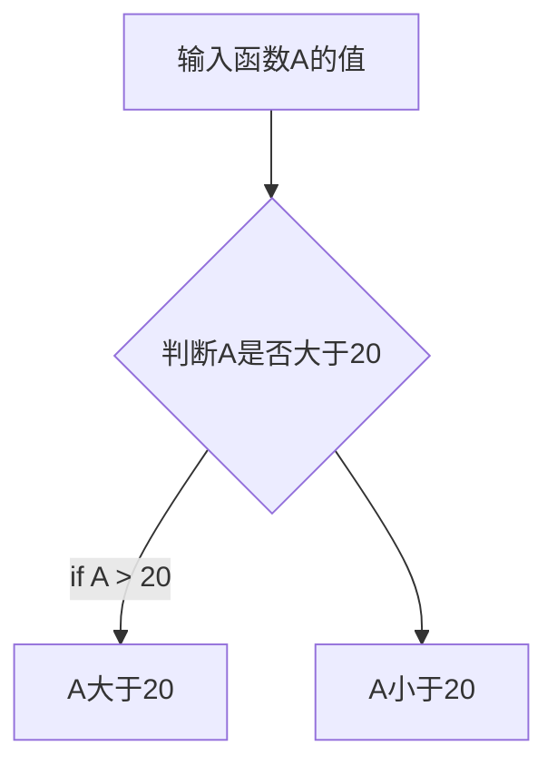

# This is a test
## The first test
```C++
#include <iostream>
using namespace std;
int main {
        cout


}
```


# *语法测试*
## **双击**
### ***是***

- 撒旦后i啊大家JFALKFJ零七啦  按客户的哇好的金卡我
1. 阿克苏NCLKASC
2. 结婚礼服凯撒父亲
3. 麻烦了什么方法
- 苏打绿没事了
- 第ask积分
- 色哦哦
[google]([【大学生扫盲课】4 typora安装与配置 markdown语法说明_哔哩哔哩_bilibili](https://www.bilibili.com/video/BV1DtrbYrEgU/?spm_id_from=333.999.0.0&vd_source=551cf71d7a2eea1f7e39e35bb1279e98))
这是`代码块`你好 
```python
print("nniniin")

```


```C++
#include <iostream>
using namespace std;
cout << Hello;
return 0;
```


```R
a <- 3
a
```

```Markdown
| biaotou |biaotou |
|-------------------|
```


| 表头1 | 表头2 | 表头3 |
| --- | --- | --- |
|     |     |     |
|     |     |     |

- [ ] 今天该干的事
- [ ] 

mermaid




# *$\frac{a}{b}$*
